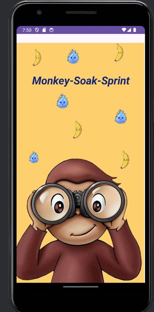
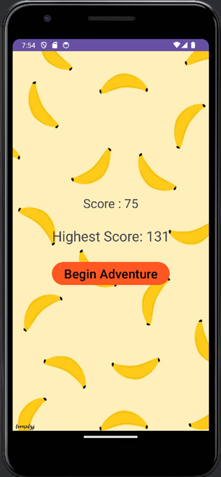
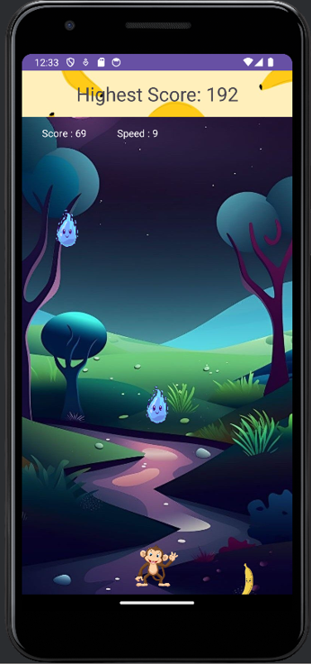

# Monkey Soak Sprint

Monkey Soak Sprint is an exciting mobile game where you must protect a monkey from raindrops while collecting bananas to increase your score. How long can you keep the monkey safe?

## Gameplay

- **Objective**: Protect the monkey from raindrops and collect as many bananas as possible to increase your score.
- **Controls**: Tap or swipe on the screen to move the monkey horizontally.
- **Scoring**: 
  - Each time the monkey successfully escapes a raindrop, your score increases by one.
  - Catching bananas increases your score by two.
- **Speed**: The speed of the raindrops gradually increases as the game progresses.
- **High Score**: Your highest score is recorded and displayed both during gameplay and on the main screen.
- **End Game**: The game ends if the monkey is hit by a raindrop.

## Instructions

1. **Objective**: Protect the monkey from raindrops and collect bananas to increase your score and achieve the highest score possible.
2. **Controls**: Tap or swipe on the screen to move the monkey horizontally, avoiding raindrops and collecting bananas.
3. **Scoring**: 
   - Score increases by one each time the monkey escapes a raindrop.
   - Collecting bananas increases your score by two.
4. **Game Over**: The game ends if the monkey is hit by a raindrop.
5. **Increasing Difficulty**: The speed of raindrops gradually increases, providing a greater challenge.
6. **High Score**: Your highest score is recorded and displayed during gameplay and on the main screen.
7. **Restart**: You can restart the game at any time to try and beat your previous high score.
8. **Start**: Begin your adventure by helping the monkey escape from the soak sprint!

## Development
-**Develeoped using kotlin**: #Android Studio
- **UI Design**: Developed mainly using LinearLayout and ConstraintLayout for intuitive UI design.
- **Data Storage**: Utilized SharedPreferences to store and update the highest score.

    
    
    

-By Samidi Jayawickrama-

